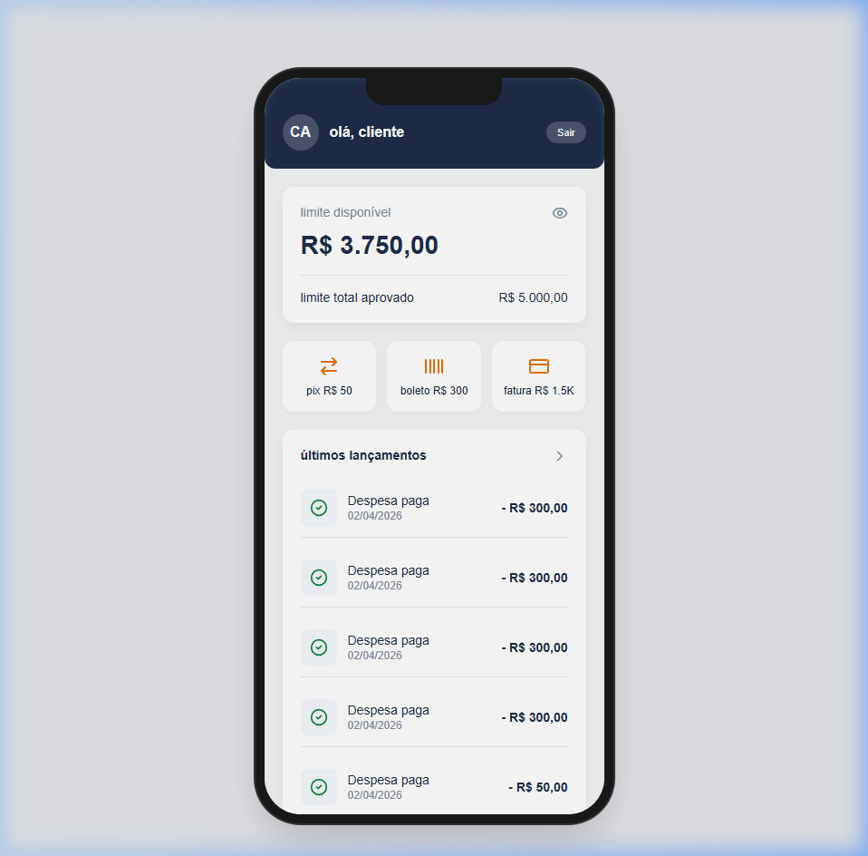

# NestJS Scalable Workers (Sistema de Autorização Financeira)

Este é um projeto **Fullstack** projetado para construir um autorizador de transações escalável, fortemente focado na integridade dos dados e em proteção contra fraudes financeiras. Ele usa arquitetura de microsserviços monorepo (API + Frontend) e está pronto para ambientes de alta volumetria em nuvem (AWS ECS).



## 🚀 Tecnologias e Stack

### Backend (API)
* **[NestJS 11]**: Framework core em Node.js.
* **[PostgreSQL 15]**: Armazenamento durável assegurando ACID.
* **[Redis 7]**: Cache distribuído em RAM utilizado para Controle de Fraude (Locks atômicos globais).
* **[TypeORM]**: Controle de migrações e de *atomic updates* com inibição de concorrência.
* **[PinoLogger]**: Log estruturado avançado pronto para ingestão no CloudWatch/Datadog.
* **[Docker & Docker-compose]**: Orquestração local dos bancos de dados.

### Frontend (User Interface)
* **[React + Vite]**: Frontend de alta performance focado na simulação do aplicativo bancário Itaú.
* **[Clean Architecture]**: Uso de padrão `Service/Repository` separando regras de interface (JSX) da lógica de negócios e I/O.
* **[Framer Motion]**: Micro-animações nativas, simulando perfeitamente a navegação de um aparelho mobile.
* **Device Frame UI**: O aplicativo renderiza o navegador central com aspecto nativo (carcaça do celular com notch simulado).

---

## ⚙️ Funcionalidades e Core Business

1. **Abertura Dinâmica de Conta**: A tela de entrada permite ao usuário (simulador) determinar seu próprio limite de crédito `POST /users`.
2. **Autorizador Atômico (Transações)**:
   * **Bloqueios Matemáticos**: Saldo é deduzido via *Pessimistic Raw Updates* impedindo transbordamentos. Se duas transações em paralelo atingem a máquina simultaneamente e o saldo exceder o limite, o postgreSQL descarta uma delas em Nível de Banco.
3. **Mecanismo Antifraude Distribuído**:
   * O sistema impede ações suspeitas travando temporariamente as chamadas do cliente. Usamos o comando `Redis SETNX` para trancar o usuário atômica e instantaneamente. (Se o usuário clicar rápido demais, a transação é interceptada pelo Redis sem encostar no banco).
4. **Idempotência**: Requisições contam com chaves únicas que barram pagamentos duplicados, protegendo a rede contra double-spending e falhas de front-end.

---

## 💻 Como Rodar o Projeto (Local)

### 1. Iniciar os Bancos de Dados (Docker)
Na pasta raiz do projeto, suba a infraestrutura base:
```bash
docker-compose up -d
```
Isso iniciará o **PostgreSQL** na porta `5432` e o **Redis** na `6379`.

### 2. Iniciar a API (NestJS)
A API lida com toda a orquestração e roda por padrão na porta `3000`.
```bash
cd api
npm install
npm run start
```

### 3. Iniciar o Frontend (React / Itaú App)
O front resolve automaticamente conexões cruzadas resolvendo os gargalos de CORS usando proxy estático do Vite.
```bash
cd frontend
npm install
npm run dev
```

Abra seu navegador em [http://localhost:5173](http://localhost:5173).

---

## ☁️ Escalabilidade (Próximos Passos na AWS)

Este projeto foi construído localmente já em formato **Cloud Native**. Os próximos passos consistem em:
1. "Dockerizar" separadamente a `api` e o `frontend` em instâncias (ou NGINX).
2. Provisionar **AWS ECS** (Fargate) sem estado (*stateless*).
3. Atrelar a API a um `Application Load Balancer`, delegando apenas o banco de dados pro RDS e o controle de fraude pro ElastiCache. O *horizontal auto-scaling* fluirá perfeitamente.
